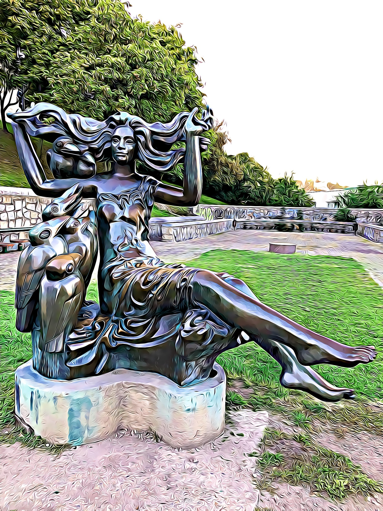
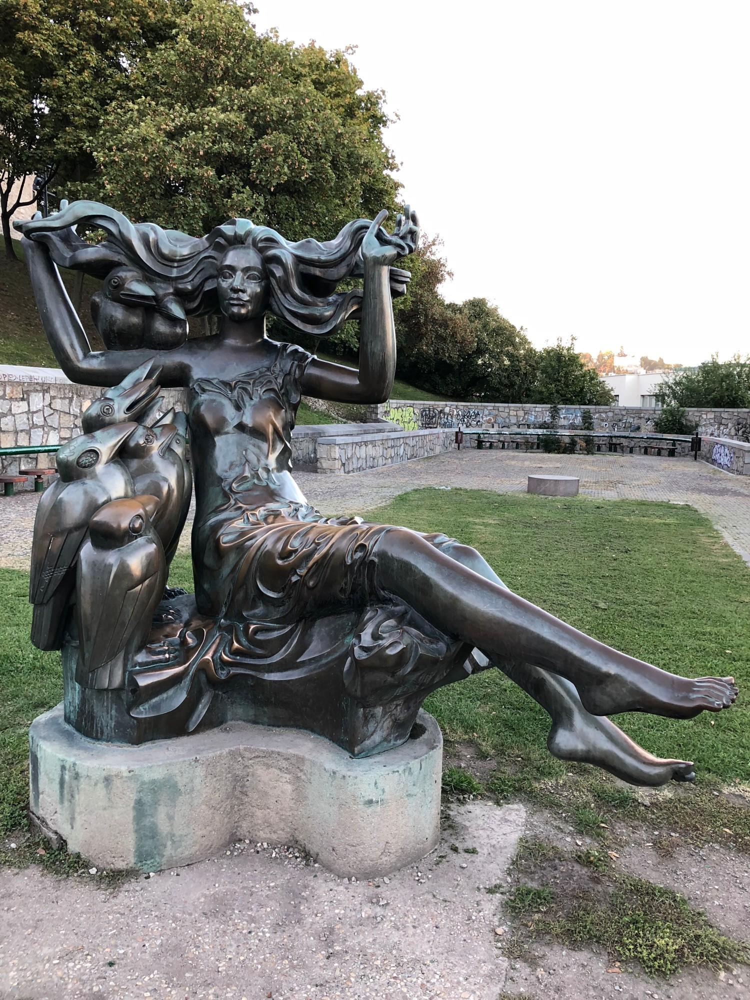

<iframe src="https://www.google.com/maps/embed?pb=!1m18!1m12!1m3!1d2662.291412348448!2d17.100647415900063!3d48.14318685874891!2m3!1f0!2f0!3f0!3m2!1i1024!2i768!4f13.1!3m3!1m2!1s0x0%3A0x0!2zNDjCsDA4JzM1LjUiTiAxN8KwMDYnMTAuMiJF!5e0!3m2!1sen!2ssk!4v1539729337882" frameborder="0" style="border:0" class="image right" allowfullscreen></iframe>
<blockquote>
Pod Bratislavským hradom sa nachádza socha ženy s havranmi od akademického sochára Tibora Bartfaya, ktorá pripomína obdobie raného novoveku v Bratislave.

Prvá žena odsúdená z bosoráctva v Bratislave bola Agatha Toott Borlobaschinová. Bola za živa upálená na hranici v roku 1602. Mala necelých 30 rokov.
</blockquote>

<h2>3D Sken</h2>

<iframe src="https://sketchfab.com/models/0b89c4b0c83547e4ace0165505da10b3/embed?preload=1" frameborder="0" allow="autoplay; fullscreen; vr" mozallowfullscreen="true" webkitallowfullscreen="true"></iframe>

Pôvodná textúra zo skenu bola poškodená, pretože sa rapídne menilo osvetlenie. Na textúru je aplikovaný ten istý filter ako na fotkách nižšie.

